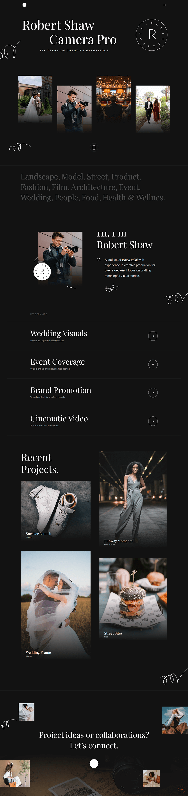

  <h1>Robert Shaw</h1>

  

    <strong>About the Project:</strong>
    Robert Shaw is a photography portfolio website built with Next.js and React. It showcases the work of a professional visual artist — including gallery shoots, services, and recent projects — in a clean, dark-themed layout designed to impress.
  

  

    <strong>Key Highlights:</strong>
    Features a custom cursor, animated hero text, auto-rotating gallery cards, scroll-based reveal effects, and a fully responsive layout across all devices.
  

  
<h2>Project Details</h2>

  

    
<h4>What's Inside</h4>

    <ul>
      <li><strong>Header</strong> — Sticky navigation with mobile menu and contact details.</li>
      <li><strong>Hero</strong> — Full-screen banner with animated rotating headline text.</li>
      <li><strong>Gallery</strong> — Auto-rotating project cards with image transitions on hover.</li>
      <li><strong>Category</strong> — Grid displaying all photography categories with hover previews.</li>
      <li><strong>About</strong> — Artist biography with signature image and decorative shapes.</li>
      <li><strong>Service</strong> — List of professional services with hover image reveal effect.</li>
      <li><strong>Portfolio</strong> — Two-column layout showcasing recent photography projects.</li>
      <li><strong>Footer</strong> — Contact call-to-action with social links and scroll progress button.</li>
      <li><strong>Preloader</strong> — Animated loading screen shown before the page fully loads.</li>
      <li><strong>ScrollReveal</strong> — Utility that fades in elements as the user scrolls down.</li>
      <li><strong>CustomCursor</strong> — Custom cursor that reacts to hovering over links and buttons.</li>
    </ul>
  

  

    
<h4>Key Features</h4>

    <ul>
      <li><strong>Animated Hero Text</strong> — Headline words rotate automatically every three seconds.</li>
      <li><strong>Auto-Rotating Gallery Cards</strong> — Gallery items cycle between two images automatically.</li>
      <li><strong>Scroll Reveal Animations</strong> — Elements fade and slide in as the user scrolls.</li>
      <li><strong>Custom Cursor</strong> — Cursor scales up smoothly when hovering interactive elements.</li>
      <li><strong>Sticky Header</strong> — Header changes background color after scrolling past the top.</li>
      <li><strong>Mobile Navigation</strong> — Slide-in menu with overlay and body scroll lock.</li>
      <li><strong>Scroll Progress Button</strong> — Back-to-top button shows live scroll percentage.</li>
      <li><strong>Data-Driven Components</strong> — All content is stored in JSON files for easy updates.</li>
      <li><strong>Fully Responsive</strong> — Layout adapts cleanly from mobile to large desktop screens.</li>
    </ul>
  

  

    
<h4>Technologies Used</h4>

    <ul>
      <li><strong>Next.js</strong> — React framework used for routing, layout, and page structure.</li>
      <li><strong>React</strong> — Component-based UI library powering all interactive sections.</li>
      <li><strong>CSS (Custom Properties)</strong> — Global styles, animations, and responsive design system.</li>
      <li><strong>JSON Data Files</strong> — Separate data files for each component to keep content organized.</li>
      <li><strong>Lucide React</strong> — Clean icon library used for buttons and UI actions.</li>
      <li><strong>Next.js Font Optimization</strong> — Google Fonts loaded via next/font for better performance.</li>
    </ul>
  

  

    
<h4>Project Structure</h4>

    <pre>
robert-shaw/
│
├── public/                         # Images for gallery, portfolio, services, and decorative shapes
│
├── src/
│   ├── app/
│   │   ├── layout.jsx              # Root layout with fonts and metadata
│   │   ├── page.jsx                # Main page assembling all components
│   │   └── index.css               # Global styles and CSS variables
│   │
│   ├── components/
│   │   ├── Preloader.jsx           # Page loading animation
│   │   ├── ScrollReveal.jsx        # Scroll-based reveal effects
│   │   ├── CustomCursor.jsx        # Interactive cursor tracking
│   │   ├── Header.jsx              # Navigation and mobile menu
│   │   ├── Hero.jsx                # Banner with rotating text
│   │   ├── Gallery.jsx             # Auto-rotating project cards
│   │   ├── Category.jsx            # Photography category grid
│   │   ├── About.jsx               # Artist biography section
│   │   ├── Service.jsx             # Professional services showcase
│   │   ├── Portfolio.jsx           # Recent projects display
│   │   └── Footer.jsx              # Footer with social links
│   │
│   └── data/
│       ├── Preloader.json          # Loading screen content
│       ├── Header.json             # Navigation and contact info
│       ├── Hero.json               # Hero section content
│       ├── Gallery.json            # Gallery cards data
│       ├── Category.json           # Category items data
│       ├── About.json              # About section content
│       ├── Service.json            # Services information
│       ├── Portfolio.json          # Portfolio projects data
│       └── Footer.json             # Footer content and links
│
├── package.json                    # Dependencies and scripts
├── next.config.mjs                 # Next.js configuration
└── README.md                       # Project documentation
    </pre>
  

  
 
    
<h4>Quick Start</h4>

    <ol>
      <li>
        <strong>Clone the repository:</strong>
        <pre><code>git clone https://github.com/nawazdevx/robert-shaw.git</code></pre>
      </li>

      <li>
        <strong>Navigate to project folder:</strong>
        <pre><code>cd robert-shaw</code></pre>
      </li>

      <li>
        <strong>Install dependencies:</strong>
        <pre><code>npm install</code></pre>
      </li>

      <li>
        <strong>Start development server:</strong>
        <pre><code>npm run dev</code></pre>
        Then visit the local URL shown in terminal (usually <code>http://localhost:3000</code>)
      </li>

      <li>
        <strong>Build for production:</strong>
        <pre><code>npm run build</code></pre>
        Production files will be generated in <code>.next/</code> folder
      </li>
    </ol>

  

 
  <strong>License:</strong>
  This project is licensed under the <a href="https://choosealicense.com/licenses/mit/">MIT License</a>.

 
  <strong>Contact:</strong> 
  Connect with me on <a href="https://www.linkedin.com/in/nawazdevx">LinkedIn</a> or visit my <a href="https://nawazdevx.vercel.app/">Portfolio</a>.

 
  <strong>Support:</strong> 
  Found this helpful? Give it a ⭐ on GitHub! Thank you.

 

  <h2>Project Preview</h2>

  

    <strong>You can view the live project here ➜</strong>
    <a href="https://robert-nawazdevx.vercel.app/" target="_blank">
      <strong>Live Demo</strong>
    </a>
  

  

